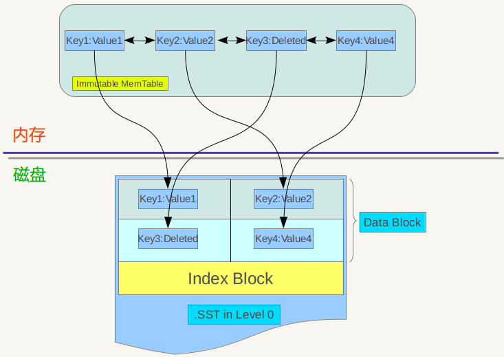

# LevelDB 纪要`：`

## LevelDB 整体架构

1. leveldb存储到磁盘上的数据是根据key值有序存储的；
2. 用户可以自定义key值的比较函数，按照用户定义的比较规则有序存储
3. 支持读写删除、和多条操作的原子批量操作；
4. leveldb支持快照功能；
5. leveldb支持压缩功能；
6. leveldb在写入一条记录时：主要包括两步：1.先写入日志文件（WAL）；2.更新内存中memtable表，即一次写操作包括一次顺序磁盘写入和内存写入,所以速度很快；
7. 根据6，系统崩溃时可以通过日志，恢复内存中没有dump到磁盘的数据；
8. 内存中的memtable的量达到一定上限，就会将其转换成immutable memtable，并生成新的log文件和memtable，继续接收新的写入请求，immutable memtable会被compaction(minor compaction)操作写入到磁盘生成新的level0 sstable文件；
9. 所有sstable文件是采用层级结构形式组织的，由level0~leveln；
10. sstable中的记录是根据key值有序存储的，并且level0中，两个sstable文件有可能存在重复的key(level0中的sstable文件直接导出的)，其他层不会出现重叠现象(major compaction是将所有涉及的两层sstable文件一起compaction,所以其他层的sstable文件之间不存在重复的key)
11. manifest文件管理所有的sstable文件信息，维护不同sstable文件所在层级，及该文件中key的最大最小值信息；
12. current文件是用来指向manifest文件的，其内容就是manifest文件名，因为leveldb中的sstable文件是不断变化的，manifest文件也会跟着变化，所有current文件就是告诉我们那个manifest文件是当前可信的；  

  

## LevelDB Log

leveldb log是用来保证更新操作的安全,所有的更新操作都要先写入到log中,这样可以保证在发生宕机时,即使memtable中的内容没有dump到磁盘,也能通过log恢复内存中的信息.

1. LevelDB 的log文件被等大小的逻辑划分成若干块,每块的大小位32KB,作为基本读取块大小;  

2. LevelDB中的日志记录都有一个统一的格式,其中包括记录头(checksum,记录长度,类型), 记录体(数据):  
   **checksum|记录长度|类型|数据**

   
   1. **checksum** 是类型和数据的的校验码,用于检查数据在存取过程中是否发生错误;
   2. **记录长度** 记录数据的大小;
   3. **类型** 记录该记录的逻辑结构与log的逻辑分块之间的关系, 其取值有四种:**FULL/FIRST/MIDDLE/LAST**:
      1. **FULL** 表示该记录在log的一个block中;
      2. **FIRST** 表示在当前block中只存放了记录的开始一部分数据,下一个block中还有该记录的数据;
      3. **MIDDLE** 表示在该block中只保存了一条记录的中间部分,其前后部分数据都保存在相邻的block中;
      4. **LAST** 表示在该block中保存了一条记录的剩余尾巴数据;
       **如果一条记录只保存在一个block中,则类型位FULL,否则会有FIRST/MIDDLE/LAST类型, MIDDLE只有在记录横跨的block数大于等于3时才有MIDDLE类型**
      > 注: LevelDB读取时,每次读取一个block大小,再根据其中记录的类型,来决定是否继续读取,来补全逻辑记录;

## SSTable文件`:`

### SSTable文件的内部数据组织结构  

#### SSTable文件的逻辑划分`:`

1. sstable文件被逻辑划分成固定等大小的block;
2. 每个block中,包含3部分:**数据|Type|CRC**
   1. 数据是存储的主体数据(KV值);
   2. Type表示是否采用压缩算法(snappy压缩算法或者无压缩算法);
   3. CRC用于校验数据,在中间处理过程中是否发生数据错误;

#### SSTable中数据内容的逻辑布局`:`

数据内容的逻辑布局都是在文件逻辑划分的基础上建立的.其内部数据组织结构如下:

1. SSTable中的内容大体可以分两部分:

   1. 数据区, 位于文件的前部分;
   2. 数据管理区,位于文件的后部分;
2. 数据区保存了KV的实际数据;
3. 数据管理区提供一些索引指针等管理数据,目的是更快捷便利的查找相应的记录;
4. 管理区的数据又根据作用不同,划分成4种不同类型:
   1. 元数据
   2. 元数据的索引
   3. 数据索引
   4. 文件尾部块
   > 注: LevelDB1.2中尚未使用元数据,和元数据索引;

* 数据索引和Footer结构:  
   **数据索引,如下图:**

数据索引区的每条记录是对data block建立的索引信息,每条索引信息包含3部分内容:

   1. 第一个字段记录对应数据块中大于等于最大的那个Key的key, 即该key值一定大于等于该block中的所有key,但不一定在该block中;
   2. 第二个字段记录该data block在sstable文件中的偏移位置;
   3. 第三个字段记录该data block的大小(有时候数据是被压缩的)为什么;  
   **Footer,如下图:**  

* Metaindex_handle记录metaindex block的起始位置和大小;
* index_handle记录index block的起始位置和大小;
* 其他就是填充数和魔数;
   **数据区, 如下图:**

有上图可以看出data block中的数据部分,又可分为两大部分:

* KV有序记录;
* 重启点和重启点的个数;

>> LevelDB中对Key有序存储,为了节省存储空间,起始的key值完全记录,后面的就只使用差异部分标示即可,当不能再使用这种方式时就再使用完全的key值记录,这个记录点就是重启点,即重新使用完全Key值记录的点;

   **记录格式,如图**

记录根据内容可以分成5部分:

* key的共享长度,即与前面的重启点key重叠的长度;
* key的非共享长度, 即非重叠部分Key的长度;
  * value长度, 即value值的大小;
  * Key非共享内容, 即非共享部分Key的值;
  * value值, 即实际的value内容;

## MemTable

* MemTable 是一直维护在内存中,运行读写操作,当MemTable的大小达到阈值就会转换成immutable Memtable,immutable Memtable是只读的,并且将其dump到磁盘变成sstable文件;
* MemTable也提供了删除操作,其删除操作是延迟删除,即只标记Key值的删除,真正的删除在compaction过程中进行;
* MemTable中KV是有序的,内部通过SkipList来维存储维护其有序性;

## LevelDB 更新操作(读写)

LevelDB的更新操作示意图:

* 插入`:`  
   将**KV**记录顺序写入到log文件中,写入成功之后再将记录插入到内存中的memtable表中,实际是插入到memtable内部的skiplist中,这样就完成了一次写入操作.
* 删除`:`  
   将**K删除标记**记录成功顺序写入log文件之后,就将该记录更新到memtable表中,就完成删除操作,即LevelDB只做标记删除,正在的删除操作在major compaction过程中完成.
* 读取`:`  
   由于LevelDB的设计,LevelDB的一个key的值可能存在多份,所以在从levelDB中读取某个key值时,就要有一定的顺序性保证读到最新的key值,其读取顺序如下:

  
**Memtable -> Immutable Memtable -> LevelDB_0(按照sst文件新鲜度去查找key值) -> LevelDB_{0 + i}(i从1开始)**

* 为什么在Level0中查找key值和其他Level中查找key值方式不同?  
         在LevelDB_0中查找某个key值和其他Level不同,主要是因为,Level_0中,key可能在多个sst文件中重复出现,所以要按照时间顺序(从最近创建时间的sst文件开始查找)在Level0文件中查找,而其他Level中key值在同一层中不存在重复现象;
* 如何定位key的位置?  
   主要分两步:
      - 找到key所在的sst文件,key在sst文件中的分布都记录在manifest文件中,该文件在内存中有副本,可以快速查找;  
      - LevelDB一般先在内存中cache中查找该key,如果没有,则加载该key所在的sst的索引部分到cache中(只加载索引到cache),通过索引可以定位Key所在的block,最后在读取该block,对里面的内容一一比对,如果找到就直接返回,如果没有则继续向下一层继续查找;

> 注`:` manifest文件中记载了level和对应文件及文件里key的信息范围,LevelDB在内存中保留这种映射表.

## compaction操作`:`

   LevelDB compaction操作是为了将已经标记删除的key物理清除,重复的key值做一个合并,丢弃老的值只保留最新的key值,以达到减少sst文件规模,提供Key值的访问速度;
   > LevelDB的compaction操作基本类似与bigtable,bigtable中包括三种compaction操作: minor，major和full; minor是将memtable到处sstable文件,major是合并不同level的sstable文件,full是合并所有sstable文件;

   LevelDB包括两种compaction操作, minor/major:

1. **minor compaction**操作是当内存中的memtable大小达到了一定的阈值,其内容就会被保存到磁盘文件sst中.如图:

  

   图中展示了,memtable中的数据达到一定的量之后,转成immutable memtable,该memtable只支持读,不能更新,然后再顺序性遍历immutable中的key,保存到新的sstable文件中,最后建立文件的index索引,整个minor compaction过程就结束了.minor compaction过程中遇到标记删除的key也不会实际删除,只是将该记录保存到sstable文件中,memtable内部是skiplist维护keys,只知道key被标记删除,但是kv数据还是不清楚在哪里,并且要找到kv数据的位置需要很复杂的查找,所以物理清除KV值的工作有major compaction来完成.  
2. **major compaction** 是当某层sstable文件数超出一定的量时,LevelDB会从这个level的sstable文件中选择一个文件(level>0),将其和高一层的sstable文件合并的过程.

* 在做level0和level1层的major compaction时,可能要选择level0中的多个文件与level1进行合并,原因是一个key可能在多个sstable中出现.
* 以key为标准轮流选择sstable文件做major compaction,即选择紧挨着上次key范围的sstable文件,做major compaction.
* 在做非level0以外的其他层major compaction时,在选择levelL A sstable文件后再在levelL+1层选择和A文件存在重复key中的所有sstable文件,做major compaction,这个也是为什么非level0成的sstable文件之间不存在重复的key;
* major compaction会把标记删除的key,在小于当前level中出现的key(),丢弃掉,

major compaction采用多路归并排行方式,合并多个sstable文件中的记录,进行重新排序.

> 任何level sstable文件中的key都是有序的,level0层的不同sstable文件中存在重复的key值(主要是因为level0是由memtable直接生成的),其他层中不存在重复的key;

## LevelDB中的cache`:`

LevelDB包括两种不同的cache: Table Cache和Block Cache.

* Table Cache
Table Cache主要缓存sstable相关的信息,sstable文件信息,sstable文件中的索引:
  
如图中Table Cache,Key是sstable的文件名,value部分包括:对应sstable文件描述符指针和sstable文件对应的table结构体指针;Table结构体中包含了sstable的index内容、block cache用的cache_id及其他内容。有了table Cache之后，当客户端要访问某个key的值时，只要确定了该key所在的level及sstable文件就可以使用table cache快速定位其所在的block，如果命中缓存就可以减少一次访问磁盘sstable索引信息IO操作，如果对应的block也在block cache就减少了访问具体block的磁盘IO操作。如果没有命中就需要访问磁盘获取sstable索引信息，和block内容，并添加到换成中。

* Block Cache
Block Cache是对sstable中block内容的缓存,使在访问key的具体内容时不必再访问磁盘.

如上图,block cache也是通过kv对的方式组织缓存,其中key是文件的cache_id和block在sstable中的偏移位置的组合,value是具体Block块内容.由此可见如果要访问的key所在的block在block cache中就可以从缓存中直接读取,减少磁盘的访问.

LevelDB的缓存从sstable文件到sstable中的block,对于局部性读操作起到很好的效果,因为命中换成的概率加大,对于随机读取就欠佳了.

## Version VersionEdit VersionSet

* Version表示当前磁盘即内存中所有的文件信息,一般只有一个Version叫做Current version.LevelDB保存了很多version.当一次compaction结束之后就会更新新建一个version来表示当前所有文件的状态,并作为current table.如果用户创建Iterator就会引用到current version,如果Iterator不在是current version,但是Iterator依然引用该版本那么该版本一直存在,直到不被引用.
* VersionSet 是所有Version的集合,管理所有存活的Version.
* VersionEdit 是Version之间的变化部分,即记录了版本切换时添加了多少文件,删除到了多少文件,该信息持久化在manifest文件中.当做数据恢复时会用到该manifest文件,来重建数据.
